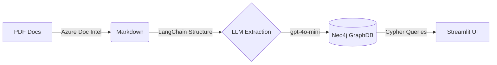

# Knowledge Graph Experiment -Pilot

> [!NOTE]
> **Experiment Status**: This is a dedicated sandbox for prototyping Knowledge Graph (KG) capabilities. It is designed to run alongside our existing **Hybrid RAG** system to evaluate the benefits of Graph Databases (Neo4j) vs. pure Vector Search.

## 🧪 Purpose & Scope

We have already established a robust Hybrid RAG architecture. This pilot focuses on **understanding and experimenting** with:

1. **Graph Database Fundamentals**: Learning how Neo4j stores and queries complex data structures compared to vector stores.
2. **Structured vs. Unstructured**: Moving from flat text chunks to typed entities (e.g., `Project`, `Person`) and relationships (e.g., `FUNDS`, `LEADS`).
3. **Graph RAG Potential**: evaluating how graph traversals can answer "multi-hop" questions that standard RAG struggles with (e.g., "Which projects funded by CRDC are led by researchers who also manage other initiatives?").
4. **High-Fidelity Ingestion**: Testing **Azure Document Intelligence** for parsing complex PDFs (tables, columns) into structured graph data.

---

## 🏗️ Architecture (Prototype)

This experiment uses a lightweight stack to iterate quickly on schema and extraction strategies:



- **Ingestion**: `build_graph.py` (Orchestrator)
- **Parsing**: Azure Document Intelligence (for layout preservation)
- **Extraction**: OpenAI `gpt-4o-mini` with Pydantic schemas (`kg_extract.py`)
- **Storage**: Neo4j Community (Dockerized)
- **Visualization**: Streamlit (`app.py`) with PyVis

## 🚀 Quick Start

### 1. Prerequisites

- Docker (for running Neo4j)
- Python 3.13+
- API Keys: OpenAI & Azure Document Intelligence

### 2. Setup

```bash
# Clone
git clone <repo>
cd CRDC-Knowledge-Graph-Pilot

# Venv
python3 -m venv venv
source venv/bin/activate
pip install -r requirements.txt
```

### 3. Environment

Create a `.env` file:

```env
NEO4J_PASSWORD=cotton-crdc-pw
AZURE_DOCUMENT_INTELLIGENCE_ENDPOINT=your_endpoint
AZURE_DOCUMENT_INTELLIGENCE_KEY=your_key
OPENAI_API_KEY=your_key
```

### 4. Run the Experiment

**Start Database:**

```bash
docker compose up -d
```

**Ingest Data (Build the Graph):**

```bash
python build_graph.py
```

**Launch Explorer UI:**

```bash
streamlit run app.py
```

_Open [http://localhost:8501](http://localhost:8501)_

---

## 📊 Current Capabilities

This prototype currently supports:

- **Typed Nodes**: `Organization`, `Project`, `Person`, `StrategicGoal`, `Amount`, `Program`.
- **Rich Relationships**: `FUNDS`, `MANAGES`, `PARTNERS_WITH`, `DELIVERS`, `FOCUSES_ON`.
- **Visual Exploration**: Interactive network graph to see connections between entities.
- **Persistence**: Docker volume mount ensures data survives container restarts.

_This is an internal experimental repository._
